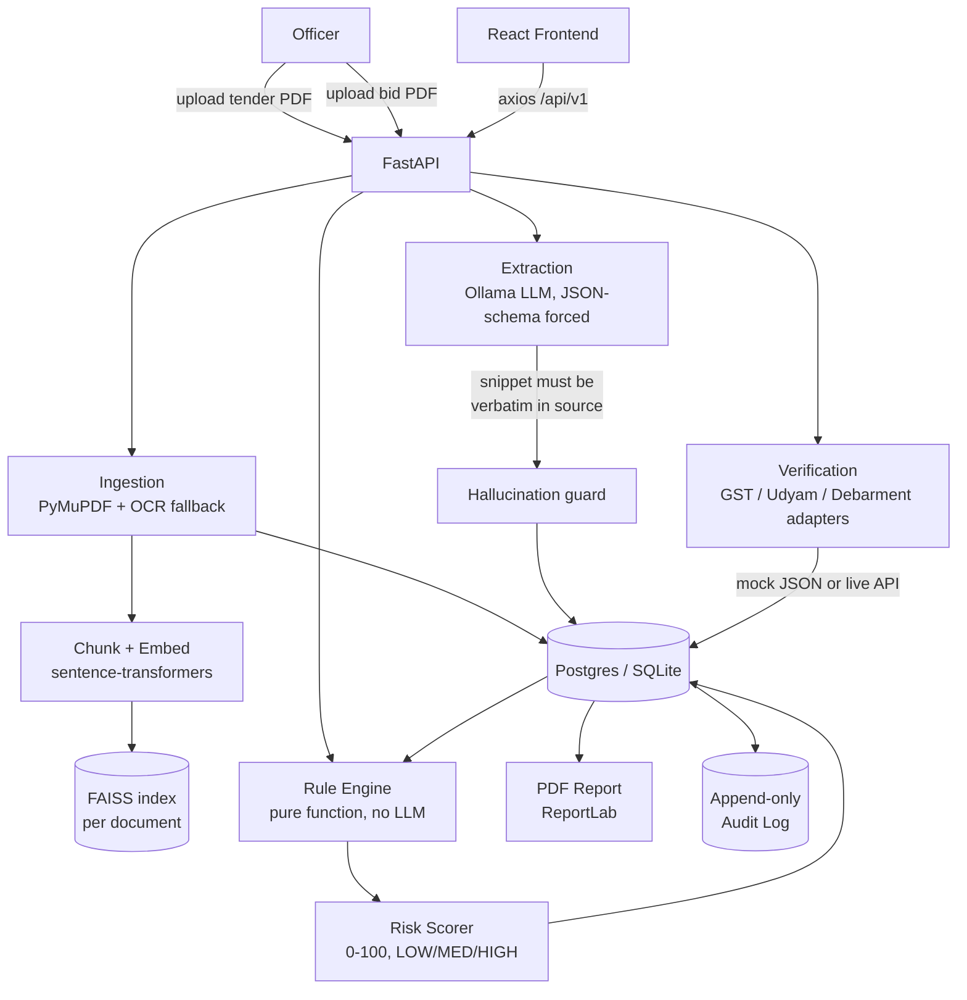

# TenderGuard — How It's Built, Step by Step

This is a from-the-ground-up walkthrough of the TenderGuard codebase: what
each layer does, why it's shaped the way it is, and how a PDF upload
eventually becomes a PASS/FAIL compliance verdict. It's written from reading
the actual code (`backend/app/`, `frontend/src/`) — every claim below maps to
a real file.

**One sentence version:** an officer uploads a tender PDF and a vendor's bid
PDF; an LLM *extracts* structured facts from both (it never judges anything);
those facts get checked against real government records; a deterministic
Python rule engine — no AI involved at all — turns that into a PASS/FAIL/
NEEDS-REVIEW compliance matrix, a 0–100 risk score, and a citable PDF report.

---

## 1. The problem this solves

A government tender lists eligibility criteria ("bidder must have ≥ Rs 5 Cr
average turnover", "must not be blacklisted", "must hold a valid GST
registration"). A vendor submits a bid PDF making claims against those
criteria. Today, an officer manually cross-checks every claim against the
tender text and against portals like the GST or Udyam registry — slow, and
easy to miss a mismatch between what's *claimed* and what's *actually true*.

TenderGuard automates that cross-check, but with one hard rule baked into the
architecture:

> **The LLM extracts. It never decides.**
> Every PASS/FAIL/NEEDS-REVIEW verdict comes from
> `backend/app/services/rules/engine.py` — a pure function, no LLM calls, no
> I/O. Same input, same output, every time. The LLM's only job is turning
> messy PDF text into structured JSON; a separate, deterministic, auditable
> engine does the actual judging.

This matters because a compliance decision that can silently vary between two
runs of the same document is not something you can put in front of a
government auditor.

---

## 2. Tech stack

| Layer | Technology | Why |
|---|---|---|
| Backend framework | **FastAPI** (0.141) + **Uvicorn** | async Python API, auto-generated OpenAPI docs at `/docs` |
| Data validation | **Pydantic v2** / **pydantic-settings** | request/response schemas + typed `.env`-driven config |
| Database ORM | **SQLAlchemy 2.0** + **Alembic** | typed models, versioned migrations |
| Database | **PostgreSQL** in production (Docker), **SQLite** for local dev without Docker | dialect-generic column types (`Uuid`, `JSON`, not `postgresql.UUID`/`JSONB`) keep one codebase working on both |
| Background jobs | **Celery** + **Redis** (with a synchronous inline fallback) | non-blocking PDF ingestion, degrades gracefully if Redis is down |
| PDF text extraction | **PyMuPDF (fitz)** | per-page text + word-level bounding boxes |
| OCR fallback | **OpenCV** (deskew/denoise) + **Tesseract** (`pytesseract`) | for scanned pages with little embedded text |
| LLM runtime | **Ollama**, running a local model (e.g. `qwen2.5:3b`, `llama3.1:8b`) | local, offline, no API key, temperature/seed pinned for determinism |
| Embeddings | **sentence-transformers**, model `all-MiniLM-L6-v2` (384-dim) | small enough to run on CPU |
| Vector index | **FAISS** (`IndexFlatIP`), with a pure-NumPy brute-force fallback | one small index per document, persisted to disk — no separate vector-DB service |
| Rule engine | Hand-rolled Python (YAML rule packs) | deterministic, officer-editable, auditable |
| PDF report generation | **ReportLab** | compliance matrix + evidence appendix as a downloadable PDF |
| Logging | **structlog** | structured JSON logs |
| Testing | **pytest** (+ `pytest-asyncio`) | unit + integration tests |
| Frontend framework | **React 19** + **Vite 8** | SPA, fast dev server with HMR |
| Frontend routing | **react-router-dom v7** | `Upload → Requirements → ComplianceMatrix → EvidenceViewer → Reports` |
| Frontend styling | **Tailwind CSS v4** (via `@tailwindcss/vite`) | utility-first styling |
| HTTP client | **axios** | thin wrapper around `/api/v1/*` |
| Frontend state | React Context (`SessionContext`, `ToastContext`) | tender/bid IDs persisted to `localStorage` |
| Orchestration | **docker-compose** (postgres, redis, ollama, api, worker, frontend, nginx) | one-command full stack |

---

## 3. High-level architecture



The single most important line in that diagram: **RULES never touches EXT
directly** — it only reads facts that already landed in the database, and it
makes no network or LLM calls. That separation is what makes a compliance
verdict reproducible.

---

## 4. Step by step: what happens when you upload a tender

### Step 1 — Upload (`POST /tenders`)

`app/api/v1/routes/tenders.py` receives the multipart PDF, computes its
**SHA-256 hash** (`ingestion/hashing.py`), and checks whether a `Document`
with that hash already exists — a re-upload is detected as a duplicate rather
than reprocessed. The file is saved to `data/uploads/tender/`, a `Document`
row is created, and the response returns immediately with a `job_id` — it
does **not** wait for text extraction.

```
POST /tenders  →  { tender_id, document, job_id, duplicate }
```

**Why it returns instantly:** `services/ingestion/enqueue.py` first probes
whether Redis is actually reachable. If a Celery worker is up, ingestion is
queued as a background task. If not, ingestion runs **inline**, synchronously,
right there in the request — so the upload always completes correctly, it's
just a matter of whether the officer waits a second longer. This is the
"degrade gracefully, never break" pattern you'll see repeated throughout the
codebase.

### Step 2 — Ingestion (`services/ingestion/pipeline.py`)

For every page of the PDF:

1. **`pdf_loader.py`** (PyMuPDF) pulls the embedded text layer and
   word-level bounding boxes.
2. If a page has **under ~50 characters** of embedded text (a scanned page,
   typically), it's handed to **`ocr.py`**: OpenCV deskews/denoises the page
   image, then Tesseract OCRs it. If OCR itself fails, the page is marked
   `low_confidence` rather than the whole ingestion job crashing — a bad scan
   surfaces for officer review instead of silently producing garbage text.
3. **`layout.py`** detects headings (for chunking, see §6).
4. Every page becomes a `DocumentPage` row (`text`, `ocr_used`,
   `ocr_confidence`, `low_confidence`, `layout` bounding boxes) and is
   committed to the database.
5. Only **after** all pages are persisted does the pipeline build the
   retrieval index (§6) — indexing failure is logged but never marks an
   otherwise-successful ingest as failed, since retrieval is "an enhancement,
   not core to ingestion."

### Step 3 — Extraction (`services/extraction/`, `services/llm/`)

This is the one place an LLM touches the system. `services/llm/client.py`
wraps Ollama's `/api/generate` with **temperature 0 and a pinned seed (42)**
— same prompt, same model, same output, every run. It's called once per page
with a prompt asking for structured JSON (either tender **requirements** or
bid **claimed facts**, depending on the document type).

The output isn't trusted blindly. Two guardrails sit between the LLM and the
database:

- **`llm/json_guard.py`** — forces `format: json` on the Ollama call, then
  validates the response against a Pydantic schema. If it's invalid JSON or
  doesn't match the schema, the model is shown its own broken output plus the
  validation error and asked to fix it (up to 2 repair attempts) before the
  whole extraction fails loudly, rather than silently accepting garbage.
- **`extraction/snippet_guard.py`** — **the hallucination guardrail.** Every
  extracted requirement/fact must carry a verbatim source snippet. This
  function checks — with only whitespace normalized, nothing fuzzy — that the
  snippet actually appears in the page text the LLM was given:

  ```python
  def is_snippet_grounded(snippet: str, source_text: str) -> bool:
      return _normalize(snippet) in _normalize(source_text)
  ```

  If the LLM invents a snippet that isn't literally on the page, the
  extraction is rejected. This is the mechanical enforcement of "the LLM
  extracts, it never invents."
- **`extraction/normalizers.py` / `fact_normalization.py`** — the one place
  messy human strings ("Rs. 5,00,00,000", "5 Cr", "5L") become typed values
  (a plain number). Nothing downstream ever parses a raw string again.

### Step 4 — Verification (`services/verification/`)

`POST /bids/{id}/verification` looks the vendor up against government
portals through a common `PortalAdapter` interface. `registry.py` switches
between **mock** and **live** adapters based on `VERIFICATION_MODE`:

```python
_MOCK_ADAPTERS = {"GST": MockGstAdapter, "UDYAM": MockUdyamAdapter, "DEBARMENT": MockDebarmentAdapter}
_LIVE_ADAPTERS = {"GST": GstAdapter, "UDYAM": UdyamAdapter, "DEBARMENT": MockDebarmentAdapter}
```

- **Mock mode** (the default, and what makes the whole demo work with the
  network off) reads canned JSON fixtures from `data/mock_portals/*.json`.
- **Live mode** hits real GST/Udyam APIs. Debarment has no live adapter at
  all — a deliberate scope decision — so it stays mock-only in both modes.
- Live adapters **degrade to `status=DOWN`** rather than raising an exception
  when unreachable or unconfigured — the system must never produce a false
  PASS or FAIL just because a government API timed out.
- Results are cached per bid+portal for `VERIFICATION_CACHE_TTL_SECONDS`
  (`verification/cache.py`), which also has to normalize naive-vs-aware
  datetimes since SQLite (unlike Postgres) doesn't preserve timezone info on
  a `DateTime(timezone=True)` column.

### Step 5 — Rules (`services/rules/engine.py`)

This is the deterministic core. A **rule pack** is a YAML file
(`backend/rules/*.yaml`) describing the criteria for one tender category
(`goods`/`works`/`services`) — see §7 for the full spec. `engine.py` is a
**pure function**:

```python
def evaluate_rule_pack(pack, *, claimed, verified, context) -> list[FindingResult]
```

For each rule, it:

1. Skips the rule entirely if `applies_if` evaluates false (e.g. an
   MSME-benefit rule only applies if `bid.claims_msme_benefit == true`).
   `applies_if` is parsed by a **tiny hand-written grammar** in
   `condition.py` — deliberately never `eval()`, because rule packs are
   officer-editable YAML data, not trusted code.
2. Resolves the rule's `fact` value by walking `source_priority` in order —
   typically `[government, document]`, meaning the GST-verified number wins
   over the vendor's own claim. **This is the actual fraud-detection
   mechanism**: if a vendor claims Rs 6.2 Cr turnover but GST records show
   Rs 4.1 Cr, the engine checks the 4.1 Cr, and that gap becomes visible in
   the finding.
3. Evaluates a fixed operator set (`operators.py`: `gte`, `lte`, `gt`, `lt`,
   `eq`, `in`, `regex`, `date_before`, `date_after`, `exists`) against either
   a literal `value` or a `threshold_from` context key (e.g. the turnover
   threshold the tender itself specifies).
4. Produces a `FindingResult` with `status` (`PASS`/`FAIL`/`NEEDS_REVIEW`),
   a human-readable `reason`, and the `claimed` and `verified` values side by
   side — never one without the other, so the mismatch is always visible in
   the output, not just internally.

If a fact can't be resolved from any source, or a needed threshold wasn't
extracted, the result is `NEEDS_REVIEW` — never a guessed PASS or FAIL.

### Step 6 — Risk scoring (`services/risk/scorer.py`)

Turns a list of findings into one number and one band:

```python
raw_score = total_risk_contribution / total_weight * 100   # 0-100
score = max(raw_score, 66) if any BLOCKER-severity rule FAILed else raw_score
band  = "HIGH" if that BLOCKER failed else LOW(<34) / MEDIUM(<66) / HIGH
```

A FAILed rule contributes its full `weight` to `total_risk`; a
`NEEDS_REVIEW` contributes half. The key design choice: **a FAILed
`BLOCKER`-severity rule (e.g. "vendor is currently debarred") forces the band
to `HIGH` no matter what** — one disqualifying fact should never get diluted
into a comfortable score just because 26 other minor rules passed.

### Step 7 — Compliance (`services/compliance/service.py`)

The glue step. `POST /bids/{id}/compliance`:

1. Builds `claimed` (from bid extraction), `verified` (from cached
   verification results), and `context` (tender-extracted thresholds, bid
   metadata) from the database.
2. Runs `evaluate_rule_pack`.
3. **Replaces** (not appends) this bid's `Finding` rows — since the engine is
   deterministic, re-running should reflect current facts, not accumulate
   history.
4. Writes one `Evidence` row per `Finding`. This is a hard DB-level
   invariant: **a finding is never persisted without a real page
   reference.** `_resolve_evidence_fields` falls back bid page → tender page
   → page 1, but there's always something to click through to.
5. Every `Finding.requirement_id` points at a real `Requirement` row — either
   one the LLM already extracted (matched by `external_ref == rule.id`), or,
   if the officer hasn't reviewed extracted requirements yet,
   `compliance/requirement_binding.py` synthesizes one on the fly from the
   rule pack's own `label` text — so the compliance matrix is always usable,
   even before Phase 2 extraction review has happened.

### Step 8 — Reports & audit

- `GET /bids/{id}/report` streams a PDF built by **ReportLab**
  (`reports/pdf_builder.py`): summary, the full compliance matrix, and an
  evidence appendix quoting the exact snippet behind every non-PASS finding,
  plus both documents' SHA-256 hashes (so the report itself is tamper-
  evident against the source PDFs).
- `audit/trail.py` appends one row to an **append-only** `AuditLog` table for
  every upload, verification run, compliance run, and report download — the
  actor comes from an `X-Actor` header (default `"officer"`; there's no real
  auth layer yet).

---

## 5. Data model

```
Tender 1───N Requirement
Vendor 1───N Bid 1───N ClaimedFact
                  1───N VerificationResult
                  1───N Finding 1───1 Evidence
                                     (append-only) AuditLog
```

- `Tender`/`Bid` each point at a `Document` (the uploaded PDF), which owns
  `DocumentPage` rows (one per page, holding the raw text + OCR metadata).
- `Finding` carries `expected`/`claimed`/`verified` as JSON blobs so the full
  three-way comparison is preserved for the UI and the PDF report, plus
  `risk_contribution` and `severity` for the scorer.
- `Evidence` is enforced 1:1 with `Finding` — every verdict has exactly one
  concrete page/snippet it traces back to.

All models use SQLAlchemy's dialect-generic `Uuid`/`JSON` column types (not
`postgresql.UUID`/`JSONB`), which is precisely what lets the same codebase
run against Postgres in Docker and SQLite for offline local dev — a decision
worth keeping if new models get added.

---

## 6. The retrieval layer (RAG) — clause search

Separate from the extraction pipeline, there's a small retrieval-augmented
search feature: `GET /tenders/{id}/search?q=...`, for "find me the exact
clause that says X" rather than a page-by-page skim.

1. **Chunking** (`retrieval/chunker.py`) — after ingestion, page text is split
   into section-aware chunks: a new chunk starts at every detected heading,
   and within a section, text only splits further past `MAX_CHUNK_CHARS`
   (1500), at a paragraph boundary. Every chunk keeps the exact page
   number(s) it came from — a chunk can span pages, but never loses
   traceability.
2. **Embedding** (`retrieval/embeddings.py`) — each chunk is encoded with
   `sentence-transformers/all-MiniLM-L6-v2` (384-dim, CPU-friendly),
   normalized so inner product equals cosine similarity.
3. **Indexing** (`retrieval/vector_store.py`) — one **FAISS**
   `IndexFlatIP` per document, persisted to disk under
   `data/vectorstore/{document_id}.faiss` + a `.meta.json` sidecar (text,
   page numbers, heading per chunk). If FAISS's native extension can't load
   (e.g. blocked by policy), a pure-NumPy brute-force cosine index is the
   fallback — same interface, so retrieval keeps working everywhere.
4. **Search** (`retrieval/search.py`) — embeds the query the same way,
   searches the index, and returns the top-k chunks with their page numbers,
   heading, and similarity score.

Verified live: uploading `sample_road_equipment_tender.pdf` and querying
`"eligibility turnover requirement"` correctly surfaces the clause *"3.1 The
bidder must have an average annual turnover of at least Rs. 5 Crore..."* as
the top hit — the semantic ranking genuinely reflects meaning, not just
keyword overlap.

**Where this index gets built:** only during a *fresh* ingestion
(`ingest_document()` in `pipeline.py`, step 5). Because uploads are
deduplicated by SHA-256, re-uploading an already-known PDF reuses the
existing `Document` row and **skips** ingestion (and therefore index
building) entirely — expected dedup behavior, not a bug, but worth knowing if
a document's vector index seems to be missing.

---

## 7. Rule packs — how the "brain" is authored

A rule pack (`backend/rules/*.yaml`) is data, not code, so an officer can add
a new eligibility check without touching Python:

```yaml
version: 1
name: Default Goods Procurement Pack
rules:
  - id: REQ-TURNOVER
    label: "Average annual turnover ≥ tender threshold"
    severity: BLOCKER          # BLOCKER | CRITICAL | MAJOR | MINOR
    weight: 20
    fact: financials.avg_annual_turnover
    operator: gte
    threshold_from: tender.turnover_requirement
    source_priority: [government, document]   # GST record beats the vendor's own claim
```

`loader.py` parses this with **line-tracking errors**, so a malformed pack
fails fast with a line number rather than a stack trace. Every rule is
validated for required fields, a known `severity`, and having either `value`
or `threshold_from` (unless the operator is `exists`).

---

## 8. Frontend

React Router pages under `frontend/src/pages/`, walked in order:

```
Upload → Requirements → ComplianceMatrix → EvidenceViewer → Reports
```

- **`SessionContext`** (`src/store/`) holds the current tender/bid IDs and
  persists them to `localStorage` under `tenderguard.session`, so a page
  refresh doesn't lose your place mid-demo.
- **`src/api/client.js`** is a thin axios wrapper around the `/api/v1`
  endpoints.
- Vite's dev server (`vite.config.js`) proxies same-origin `/api/*` calls to
  `http://localhost:8000` (overridable via `VITE_PROXY_TARGET` for the
  Docker network), so the browser never needs a hardcoded absolute API URL.
- Styling is Tailwind v4 via the `@tailwindcss/vite` plugin — no separate
  PostCSS config step needed for the common case.

---

## 9. Running it locally (what this environment actually does)

Per `CLAUDE.md`, the intended one-command path is `docker compose up`
(Postgres, Redis, Ollama, API, worker, frontend, nginx — see
`docker-compose.yml`). On a machine without Docker, the fallback that was set
up here is:

```bash
# Backend
cd backend
.venv/Scripts/python.exe -m uvicorn app.main:app --reload --port 8000
# → http://localhost:8000/docs

# Frontend
cd frontend
npm run dev
# → http://localhost:5173
```

with `backend/.env` pointing `DATABASE_URL` at
`sqlite:///data/tenderguard.db` instead of Postgres, and `OLLAMA_MODEL` set
to whatever model is actually pulled locally (`ollama list`) rather than the
`llama3.1:8b` default. Since Redis/Celery aren't running either, uploads fall
back to the synchronous inline ingestion path described in §4 automatically
— no extra configuration needed for that part.

---

## 10. The design decisions worth remembering

1. **LLM extracts, rules decide** — the single most load-bearing boundary in
   the codebase. Never add an LLM call anywhere near
   `rules/`, `risk/`, or `compliance/`.
2. **Snippet grounding** — any LLM-extracted fact without a verbatim,
   locatable source snippet is rejected outright. This is what makes the
   system trustworthy enough to file a report from.
3. **Government beats document** — `source_priority` is how a vendor's
   inflated claim gets automatically caught against the real record, and
   it's expressed as ordinary YAML data, not special-cased Python.
4. **Never a false PASS/FAIL from a broken dependency** — a down verification
   portal, an unresolvable threshold, an OCR failure: all of these become
   `NEEDS_REVIEW` or `low_confidence`, never a silently wrong verdict.
5. **Degrade, don't break** — no Redis → run ingestion inline. No FAISS
   native extension → NumPy fallback. No Docker → SQLite. The system is built
   to keep working with pieces of the ideal stack missing.
