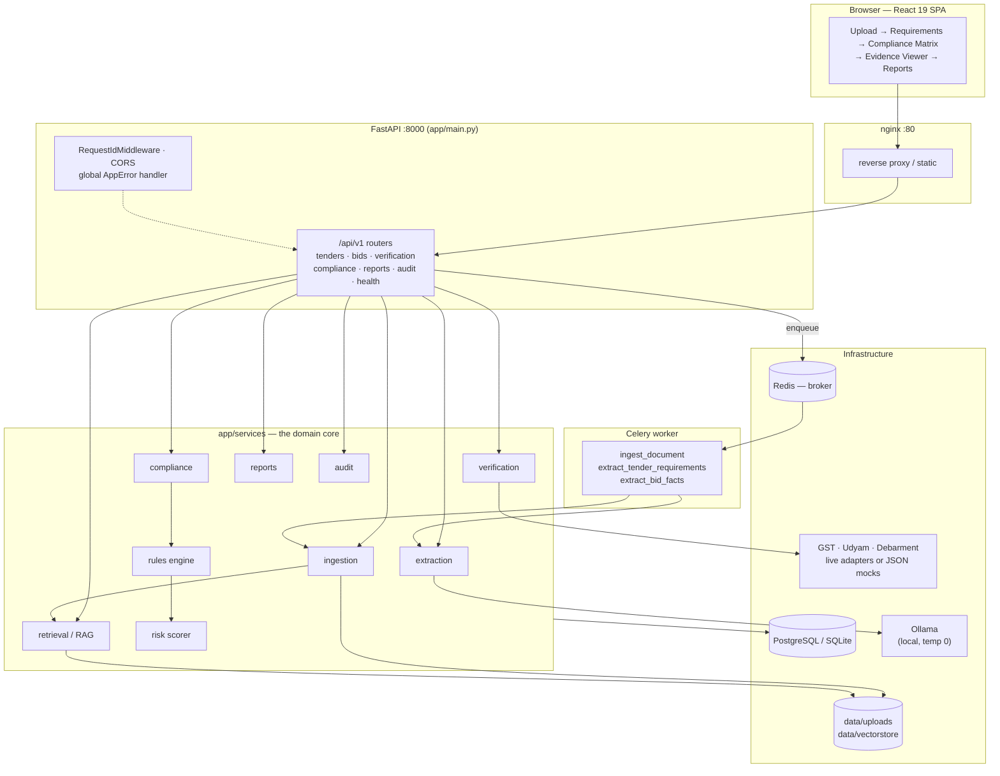
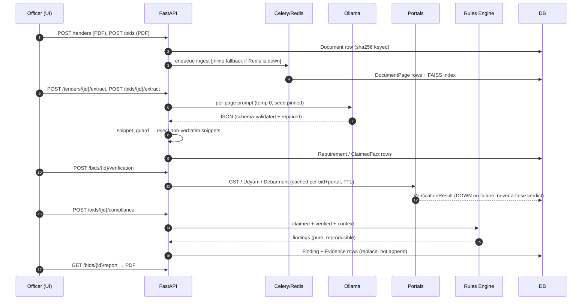
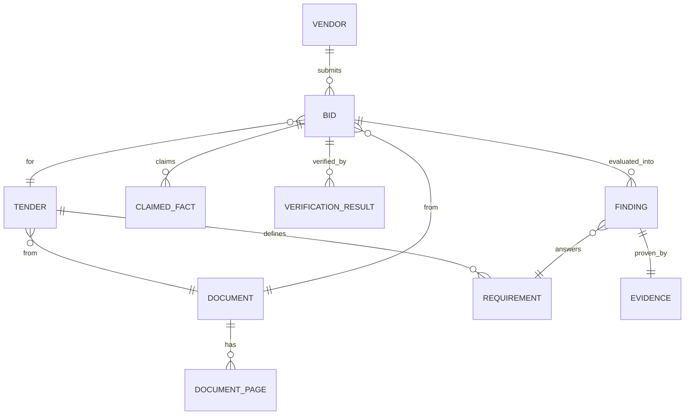

# TenderGuard — System Architecture

**Problem statement:** SIH26100 — AI Tender & Vendor Compliance Verification
**Stack:** FastAPI · SQLAlchemy/Alembic · Celery + Redis · Ollama (local LLM) · FAISS + Sentence-Transformers · React 19 + Vite + Tailwind · ReportLab

An officer uploads a **tender PDF** and a **vendor bid PDF**. TenderGuard extracts the tender's
eligibility requirements and the vendor's claimed facts, verifies those facts against government
portals (GST / Udyam / debarment), evaluates them with a deterministic YAML rule engine, and returns
a **compliance matrix** where every row carries a verdict, a reason, a weighted risk contribution,
and page-level evidence — plus a PDF report and an append-only audit trail.

---

## 1. The golden rule

> **The LLM extracts. It never decides.**

Every `PASS` / `FAIL` / `NEEDS_REVIEW` verdict is produced by `backend/app/services/rules/engine.py`,
a **pure function** — no LLM calls, no I/O, no randomness. The same inputs always produce the same
output, which is what makes the result defensible in a procurement audit.

The LLM's only job is turning unstructured PDF text into structured, snippet-backed facts. Anything
it produces that cannot be traced back to a verbatim string on a real page is rejected before it ever
reaches the rules layer.

| Layer | May use the LLM? | Deterministic? |
|---|---|---|
| Ingestion (PDF/OCR) | No | Yes |
| Extraction (requirements / facts) | **Yes** | No (guarded) |
| Verification (portals) | No | Yes (cached) |
| Rules engine | **Never** | Yes |
| Risk scoring | **Never** | Yes |
| Report / audit | No | Yes |

---

## 2. High-level architecture



### Deployment topology (`docker compose up`)

`postgres` · `redis` · `ollama` (+ one-shot `ollama-pull`) · one-shot `migrate` (`alembic upgrade head`)
· `api` (uvicorn) · `worker` (celery) · `frontend` (vite) · `nginx`.

The one-shot services are ordered with `service_completed_successfully` so a cold `docker compose up`
never leaves the API talking to a schema-less DB or an Ollama with no model pulled.

---

## 3. Request-time flow



### 3.1 Ingestion — `services/ingestion/`

| File | Responsibility |
|---|---|
| `pdf_loader.py` | PyMuPDF: per-page text + **word-level bounding boxes** |
| `ocr.py` | Pages with < ~50 chars of embedded text → OpenCV deskew/denoise + Tesseract |
| `layout.py` | Heading & table detection so the eligibility section can be located |
| `hashing.py` | SHA-256 of the file — a re-upload is detected as a duplicate, not reprocessed |
| `pipeline.py` | Orchestrates the above into `Document` / `DocumentPage` rows, then builds the vector index |
| `enqueue.py` | Probes whether Redis is actually reachable; runs ingestion **inline** if not |

Design notes:

- OCR never trusts itself silently — a low-confidence page is flagged `low_confidence` and surfaced
  for officer review. An OCR crash degrades that one page, it doesn't fail the job.
- `POST /tenders` and `POST /bids` return `201` immediately with a `job_id`; the upload always
  completes, synchronously or asynchronously, so a missing worker degrades the system instead of
  breaking it.

### 3.2 Retrieval / RAG — `services/retrieval/`

```
pages + headings ──> chunker.py ──> embeddings.py ─────> vector_store.py ──> search.py
                     section-aware   all-MiniLM-L6-v2     FAISS flat index    top-k clauses
                     ≤1500 chars     384-dim, normalized   (+ NumPy fallback)
```

- **Chunking is section-aware:** a boundary opens at every detected heading, and each chunk keeps the
  page numbers it actually came from — so a retrieved clause can always be pointed at in the PDF.
- **One index per document**, persisted to `data/vectorstore/<document_id>.faiss` + `.meta.json`.
- If the native FAISS extension can't load (e.g. blocked by an Application Control policy), a
  brute-force NumPy cosine index takes over transparently — correct at one-document scale.
- Exposed as `GET /tenders/{id}/search?q=...` — "find the clause that proves X".

### 3.3 Extraction — `services/extraction/` + `services/llm/`

- Ollama at **temperature 0 with a pinned seed**; prompts live as plain text in
  `services/llm/prompts/` (`requirement_extraction.txt`, `vendor_fact_extraction.txt`, `explanation.txt`).
- `llm/json_guard.py` forces JSON output and validates it against a Pydantic schema, with a **repair
  loop** on malformed output.
- **`snippet_guard.py` is the hallucination guardrail** — any extracted item whose `source_snippet`
  is not literally present in that page's text is rejected. This is not optional.
- `normalizers.py` / `fact_normalization.py` are the *one* place messy strings become typed values
  (`"Rs. 5,00,00,000"`, `"5 Cr"`, `"5L"` → `{"value": ..., "unit": ...}`). Nothing downstream parses
  raw strings.

### 3.4 Verification — `services/verification/`

```
base.py        PortalAdapter interface
registry.py    mock <-> live switch on VERIFICATION_MODE
adapters/      gst.py · udyam.py · mock_portal.py (GST / Udyam / Debarment)
cache.py       per bid+portal, TTL-bounded
```

- **Mock mode reads `data/mock_portals/*.json`**, so the entire demo runs with the network off.
- Live adapters degrade to `status = DOWN` when unconfigured or unreachable — they never raise and
  never produce a false `PASS`/`FAIL`; the rule downstream becomes `NEEDS_REVIEW`.
- Debarment is deliberately mock-only in both modes, so a missing live source degrades to
  `NEEDS_REVIEW` rather than silently skipping the check.
- Adding a portal = one adapter file + one registry entry.

### 3.5 Rules engine — `services/rules/` (the deterministic core)

```
loader.py     parses rule-pack YAML with line-number error reporting
engine.py     resolves each rule's fact by source_priority, then evaluates
operators.py  fixed set: gte lte gt lt eq in regex date_before date_after exists
condition.py  `applies_if` mini-grammar — NEVER eval(), rule packs are officer-editable data
```

A rule (`backend/rules/default_{goods,services,works}.yaml`):

```yaml
- id: REQ-TURNOVER
  label: Minimum average annual turnover
  severity: CRITICAL              # BLOCKER | CRITICAL | MAJOR | MINOR
  weight: 25
  fact: financials.avg_annual_turnover
  operator: gte
  source_priority: [government, document]   # govt value beats the vendor's claim
  threshold_from: tender.turnover_requirement
```

`source_priority` is the heart of fraud detection: listing `government` first means the GST record,
not the bid PDF, decides the turnover comparison — which is exactly how an inflated claim gets caught.

### 3.6 Risk scoring — `services/risk/scorer.py`

Weighted 0–100, higher = riskier: `score = Σ risk_contribution / Σ weight × 100`.

| Band | Range |
|---|---|
| LOW | ≤ 33 |
| MEDIUM | 34 – 65 |
| HIGH | > 65 |

**Override:** a FAILed `BLOCKER` rule (e.g. the vendor is debarred) forces the `HIGH` band regardless
of the numeric score — one disqualifying fact must never be diluted by a pile of unrelated passes.

### 3.7 Compliance, reports, audit

- `compliance/service.py` is the glue: builds `claimed` / `verified` / `context` from the DB, runs the
  engine, **replaces** (never appends) this bid's `Finding` rows, and writes one `Evidence` row per
  finding. Re-running is idempotent because the engine is deterministic.
- **Invariant:** a `Finding` is never persisted without a real page reference — evidence resolution
  falls back bid page → tender page → page 1.
- `compliance/requirement_binding.py`: `Finding.requirement_id` always points at a real `Requirement`
  — either one extraction already produced (matched on `external_ref == rule.id`) or one synthesized
  from the rule pack, so the matrix works even before an officer has reviewed extracted requirements.
- `reports/pdf_builder.py` (ReportLab): summary + compliance matrix + evidence appendix for every
  non-PASS finding + both documents' SHA-256 hashes.
- `audit/trail.py`: append-only row for every upload, verification run, compliance run and report
  download. Actor comes from the `X-Actor` header (default `"officer"` — there is no real auth yet).

---

## 4. Data model



| Table | Key columns | Notes |
|---|---|---|
| `documents` | `kind`, `sha256` (unique), `page_count`, `status` | dedupe by hash |
| `document_pages` | `text`, `layout` (word bboxes), `ocr_used`, `ocr_confidence`, `low_confidence` | evidence source |
| `tenders` | `title`, `reference_no`, `category` | goods / services / works |
| `requirements` | `external_ref`, `text`, `expected`, `source_page`, `source_snippet`, `human_reviewed` | officer-editable |
| `vendors` | `name`, `gstin`, `pan`, `udyam_number` | indexed identifiers |
| `bids` | `vendor_id`, `tender_id`, `document_id`, `claims_msme_benefit` | drives `applies_if` |
| `claimed_facts` | `fact_key`, `raw_value`, `normalized_value`, `source_page`, `source_snippet` | verbatim + typed |
| `verification_results` | `portal`, `status`, `normalized`, `raw_response`, `fetched_at` | TTL-cached |
| `findings` | `rule_id`, `status`, `reason`, `severity`, `weight`, `risk_contribution`, `rule_pack_sha256`, `engine_version` | **reproducible: the pack hash + engine version are stored with the verdict** |
| `evidence` | `document_id`, `page_number`, `bbox`, `snippet`, `document_sha256` | 1:1 with a finding |
| `audit_logs` | `actor`, `action`, `entity_type`, `before`, `after`, `timestamp` | append-only |

All models use dialect-generic `Uuid` / `JSON` column types (not `postgresql.UUID` / `JSONB`) so the
identical code runs on PostgreSQL and SQLite. Keep it that way when adding models.

---

## 5. API surface (`/api/v1`)

| Method | Path | Purpose |
|---|---|---|
| `GET` | `/health` | liveness |
| `POST` | `/tenders` | upload tender PDF → `job_id` |
| `GET` | `/tenders/{id}` | tender + ingestion status |
| `GET` | `/tenders/{id}/pages` | page text / OCR flags |
| `POST` | `/tenders/{id}/extract` | LLM requirement extraction |
| `GET` | `/tenders/{id}/requirements` | extracted requirements |
| `PATCH` | `/tenders/{id}/requirements/{rid}` | officer edit / review sign-off |
| `GET` | `/tenders/{id}/search?q=` | RAG clause search |
| `POST` | `/bids` | upload bid PDF |
| `GET` | `/bids/{id}`, `/bids/{id}/pages` | bid + pages |
| `POST` | `/bids/{id}/extract` | LLM claimed-fact extraction |
| `POST` / `GET` | `/bids/{id}/verification` | run / fetch portal verification |
| `POST` / `GET` | `/bids/{id}/compliance` | run / fetch compliance matrix + risk |
| `GET` | `/bids/{id}/report` | PDF report download |
| `GET` | `/audit` | audit trail |

Every response — success or failure — uses the same envelope. Errors are raised as
`AppError(code, message, status_code, detail)` and normalised by the global handler in
`core/errors.py` into `{code, message, detail}`; an `X-Request-ID` is attached by
`RequestIdMiddleware` and logged by `structlog`.

---

## 6. Frontend — `frontend/src/`

```
Upload ──► Requirements ──► ComplianceMatrix ──► EvidenceViewer ──► Reports
   │            │                  │                   │              │
   └────────────┴──── SessionContext (tender/bid ids) ─┴──────────────┘
                      persisted to localStorage["tenderguard.session"]
```

- React 19 + React Router 7 + Tailwind 4, built by Vite 8, linted by oxlint.
- `src/api/client.js` — a thin axios wrapper over `/api/v1`.
- `src/store/` — `SessionContext` (shared tender/bid ids) and `ToastContext`.
- Components: `FileDrop`, `ApiStatus`, `NavBar`, `RiskGauge`, `StatusChip`.
- In production the built SPA is served **from the FastAPI process itself** (`main.py` mounts
  `frontend/dist` when it exists) — one process, one origin, no CORS or proxy needed. If no build
  exists (pytest, or the Vite dev server), the API-only app is left untouched.

---

## 7. Configuration & environments

`app/config.py` → `Settings` (pydantic-settings) reads `backend/.env` **regardless of process cwd**,
and relative `upload_dir` / `vectorstore_dir` / `mock_portal_dir` / SQLite paths resolve against
`PROJECT_ROOT` (one level above `backend/`) — not against whatever directory a script was launched
from. `resolved_database_url` does the same for `sqlite:///` URLs so `alembic upgrade head` and the
running app always point at the same file.

| Setting | Default | Notes |
|---|---|---|
| `DATABASE_URL` | Postgres | the only change needed to switch backends |
| `REDIS_URL` | `redis://localhost:6379/0` | unreachable → inline ingestion |
| `OLLAMA_BASE_URL` / `OLLAMA_MODEL` | `localhost:11434` / `llama3.1:8b` | temp 0, pinned seed |
| `VERIFICATION_MODE` | `mock` | `mock` \| `live` |
| `VERIFICATION_CACHE_TTL_SECONDS` | `3600` | per bid+portal |
| `TESSERACT_CMD` | unset | Windows path override |
| `MAX_UPLOAD_MB` | `50` | |
| `CORS_ORIGINS` | `http://localhost:5173` | comma-separated |

**Local dev note (this machine):** Docker isn't installed and the PostgreSQL installer is blocked by a
network-level 403 on `get.enterprisedb.com`, so the backend runs on SQLite
(`DATABASE_URL=sqlite:///data/tenderguard.db`) with Ollama started natively via `ollama serve`.
Docker's `api`/`worker` services override the three data dirs directly in `docker-compose.yml`,
because `./data` is mounted at `/app/data` there rather than as a sibling of the backend.

---

## 8. Repository layout

```
project/
├── backend/
│   ├── app/
│   │   ├── main.py                  FastAPI app, routers, SPA mount
│   │   ├── config.py                Settings, PROJECT_ROOT anchoring
│   │   ├── api/v1/routes/           tenders bids verification compliance reports audit health
│   │   ├── core/                    errors · logging · deps · broker_check
│   │   ├── db/                      session · base · alembic migrations
│   │   ├── models/                  SQLAlchemy ORM (dialect-generic)
│   │   ├── schemas/                 Pydantic request/response models
│   │   ├── services/                ingestion extraction retrieval verification
│   │   │                            rules risk compliance reports audit llm
│   │   └── workers/                 celery_app · tasks
│   ├── rules/                       default_goods|services|works.yaml
│   └── tests/                       pytest: rules engine, extraction, snippet guard, compliance
├── frontend/                        React 19 + Vite + Tailwind SPA
├── data/                            uploads · vectorstore · mock_portals · samples · sqlite db
├── docs/                            architecture · api · rule_pack_spec · demo_script
├── infra/nginx/                     nginx.conf
├── scripts/                         generate_sample_pdfs · load_sample_data · run_pipeline_cli
└── docker-compose.yml
```

---

## 9. Design decisions worth defending

| Decision | Why |
|---|---|
| Rules engine is a pure function, no LLM | A procurement verdict must be reproducible and explainable in an audit. |
| Snippet guard on every extraction | A hallucinated requirement is worse than a missed one; nothing enters the DB without verbatim page text behind it. |
| Rule packs are YAML data, `applies_if` parsed by a mini-grammar | Officers edit rules; `eval()` on officer-editable data is a code-execution hole. |
| `source_priority: [government, document]` | Government records beat the vendor's own claim — this is what catches inflated turnover. |
| Portal failure → `DOWN` → `NEEDS_REVIEW` | Never a false PASS or FAIL from an outage. |
| Rule-pack SHA-256 + engine version stored on every finding | You can prove *which* rules produced a past verdict. |
| Findings replaced, not appended, on re-run | Determinism means the matrix should reflect current facts, not history. |
| Redis-optional ingestion, FAISS-optional retrieval, mock-mode portals | The full demo runs offline on one machine with no external dependency. |
| Dialect-generic column types | The same code runs on Postgres (prod) and SQLite (this laptop). |
| Append-only audit log | Every officer action is attributable and immutable. |

---

## 10. Running it

```bash
# One command (intended path)
docker compose up

# Backend — from backend/
.venv/Scripts/python.exe -m uvicorn app.main:app --reload --port 8000   # http://localhost:8000/docs
.venv/Scripts/python.exe -m pytest -q
.venv/Scripts/python.exe -m alembic upgrade head
celery -A app.workers.celery_app worker --loglevel=info --pool=solo     # Windows needs --pool=solo

# Frontend — from frontend/
npm run dev        # http://localhost:5173
npm run build      # then FastAPI serves the SPA itself

# Demo data — from the project root
python scripts/generate_sample_pdfs.py    # once
python scripts/load_sample_data.py        # seed + verify + compliance
python scripts/run_pipeline_cli.py        # end-to-end, no API/UI needed
```

**Further reading:** `docs/architecture.md` (narrative flow) · `docs/rule_pack_spec.md` (rule YAML
reference) · `docs/api.md` (endpoint reference) · `docs/demo_script.md` (demo walkthrough).
